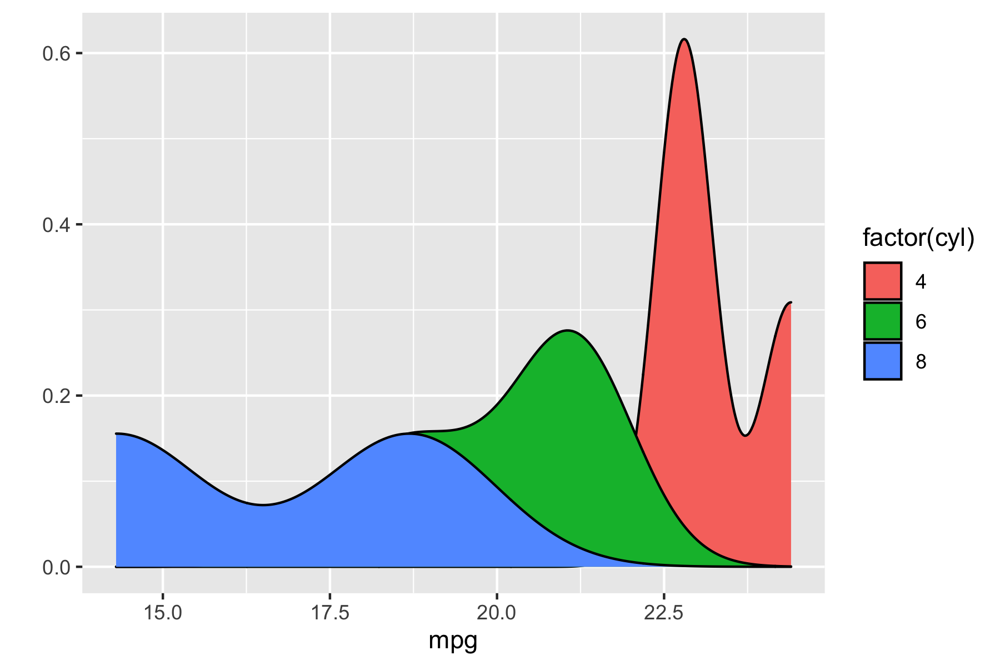

<!-- README.md is generated from README.Rmd. Please edit that file -->

```{r, include = FALSE}
knitr::opts_chunk$set(
  collapse = TRUE,
  comment = "#>",
  fig.path = "man/figures/README-",
  out.width = "100%"
)
```

# rush

<!-- badges: start -->
[](https://github.com/jeroenjanssens/rush/actions)
<!-- badges: end -->

`rush` is an R package that allows you to run expressions, create plots, and install packages directly from the shell.

## Installation

You can install the development version of `rush` with:

```r
remotes::install_github("jeroenjanssens/rush")
```

## Examples

```{r, include=FALSE}
knitr::opts_knit$set(root.dir="exec")
```

`rush` should be invoked from the command line. The executable is located in the *exec* sub-directory of the package directory.

```{bash}
./rush run 6*7
```

Read from standard input:

```{bash}
seq 6 | ./rush run -H '2 * sum(df$x1)' -
```

Write to standard output:

```{bash}
./rush run 'head(mtcars, 10)' | tee mtcars.csv
```

Show generated script with the `--dry-run` option:

```{bash}
< mtcars.csv ./rush qplot --dry-run --x mpg --geom density --fill 'factor(cyl)'
```

Create plots with the `qplot command`:

```{bash}
< mtcars.csv ./rush qplot --x mpg --geom density --fill 'factor(cyl)' > ../man/figures/mtcars.png 
```



## Help

```{bash}
./rush -h
```

```{bash}
./rush run -h
```

```{bash}
./rush qplot -h
```

```{bash}
./rush install -h
```

```{r, include=FALSE}
knitr::opts_knit$set(root.dir=".")
```

```{bash, include=FALSE}
rm exec/mtcars.csv
```

## Code of Conduct

Please note that the rush project is released with a [Contributor Code of Conduct](https://contributor-covenant.org/version/2/0/CODE_OF_CONDUCT.html). By contributing to this project, you agree to abide by its terms.
