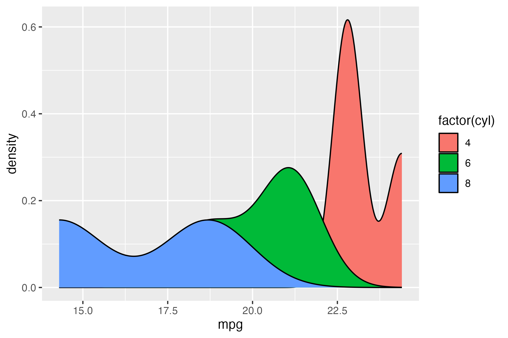

<!-- README.md is generated from README.Rmd. Please edit that file -->

```{r, include = FALSE}
knitr::opts_chunk$set(
  collapse = TRUE,
  comment = "#>",
  fig.path = "man/figures/README-",
  out.width = "100%"
)
```

# rush

<!-- badges: start -->
[](https://github.com/jeroenjanssens/rush/actions/workflows/R-CMD-check.yaml)
<!-- badges: end -->

**`rush` brings R to the command line.** Run an R expression, wrangle a CSV,
query a Parquet file with SQL, or draw a plot right in your terminal — all
without opening an R session or writing a script.

```sh
rush run 'mtcars |> dplyr::filter(mpg > 25) |> head()'
```

R has a wonderful ecosystem for working with data, but reaching for it usually
means launching R, loading packages, and reading files by hand. `rush` collapses
that into a single command you can pipe, redirect, and drop into any shell
pipeline — so R becomes just another Unix tool, at home next to `grep`, `awk`,
and `jq`.

Under the hood, each invocation assembles a small, self-contained R script and
runs it with [`ir`](https://r-lib.github.io/ir/), the R interpreter launcher
from r-lib. The script declares its own package dependencies in `#|`
frontmatter, and `ir` installs whatever it needs on the fly. That means `rush`
itself stays lightweight, and you never have to manage a library of packages
just to run a one-liner.

## Highlights

- **One-liners, not scripts.** Evaluate any R expression straight from the shell.
- **Pipeline-native.** Reads from standard input and writes to standard output,
  so it composes with every other command-line tool.
- **Reads what you have.** CSV and other delimited text, [Parquet](#parquet),
  [JSON/JSONL](#json), [Excel](#excel), [Arrow IPC](#arrow), and
  [DuckDB](#duckdb) databases — chosen automatically by file extension.
- **Converts between formats.** The [`convert`](#format-conversion) command
  converts files directly between any supported format.
- **Query with SQL.** The [`sql`](#querying-with-sql) command runs DuckDB
  queries directly against your files, no import step required.
- **Plots in your terminal.** The [`plot`](#plotting) command renders ggplot2
  graphics as ANSI/ASCII art, or saves them to PNG, PDF, and more.
- **Zero dependency management.** Packages are resolved on demand by `ir`.

## Installation

First install [`ir`](https://r-lib.github.io/ir/#installation). Then install
`rush` as an `ir` tool, which puts a `rush` launcher on your `PATH`:

```sh
ir tool install github::jeroenjanssens/rush
```

That's it — there's no separate R package to load. The first time a command
needs a package (say, ggplot2 for a plot), `ir` fetches and caches it for you.

## A quick tour

```{r, include=FALSE}
knitr::opts_knit$set(root.dir="exec")
```

```{bash, include=FALSE}
# Build a small example DuckDB database for the data-file and SQL sections.
rush run -l duckdb,DBI '{
  con <- DBI::dbConnect(duckdb::duckdb(), "shop.duckdb")
  DBI::dbWriteTable(con, "customers", data.frame(id = 1:3, name = c("Alice", "Bob", "Carol")))
  DBI::dbWriteTable(con, "orders", data.frame(cust = c(1, 1, 2, 3, 3), amount = c(20, 35, 10, 50, 15)))
  DBI::dbDisconnect(con, shutdown = TRUE)
  invisible()
}' 2>/dev/null
```

Evaluate an expression — the value of the last expression is printed:

```{bash}
rush run '6 * 7'
```

Read from standard input with `-`. Input is read into a data frame called `df`,
so `seq 6` becomes a one-column table you can compute on:

```{bash}
seq 6 | rush run -H '2 * sum(df$x1)' -
```

Give `rush run` a file and it is read into `df` before your expression runs.
With no expression, the data frame is simply printed back out — a handy way to
peek at a file:

```{bash}
rush run 'head(mtcars, 10)' | tee mtcars.csv
```

Because `rush` writes plain CSV to standard output, you can keep piping into the
next command — including another `rush`:

```{bash}
rush run 'head(mtcars)' | rush run 'df |> dplyr::select(mpg, cyl, hp)' -
```

Load extra packages with `-l`, or enter the whole Tidyverse with `-t`:

```{bash}
rush run -t 'starwars |> count(species, sort = TRUE) |> head(3)'
```

## Working with data files

`rush` picks a reader based on the file extension, so the same commands work
whatever format your data is in. A single file is read into `df`; pass several
and each is read into a named element of a list called `dfs`.

### Delimited text

CSV is the default. Use `--delimiter` (`-d`) for other separators and
`--no-header` (`-H`) for files without a header row. For finer control, use
`--input-delimiter` and `--output-delimiter` (`-D`) to set them independently,
or `-F`/`-O` to force a specific format regardless of extension:

```{bash}
rush run 'df |> dplyr::filter(mpg > 22) |> dplyr::select(mpg, cyl, hp)' mtcars.csv
```

<a id="parquet"></a>

### Parquet

Files ending in `.parquet` or `.pq` are read with
[nanoparquet](https://nanoparquet.r-lib.org/) — no flags needed. Point
`--output` (`-o`) at a `.parquet` file to write one, which makes `rush` a quick
way to convert between formats:

```{bash}
# Convert CSV to Parquet...
rush run --output mtcars.parquet 'df' mtcars.csv

# ...then read it straight back
rush run 'head(df, 3)' mtcars.parquet
```

<a id="duckdb"></a>

### DuckDB

Point `rush` at a [DuckDB](https://duckdb.org/) database (`.duckdb` or `.ddb`)
and every table is read into the `dfs` list, keyed by table name:

```{bash}
rush run 'names(dfs)' shop.duckdb
```

If a database holds a single table, it is also bound to `df` for convenience,
so a one-table database behaves just like any other single input.

<a id="json"></a>

### JSON and JSONL

Files ending in `.json` are read with `jsonlite::fromJSON`; `.jsonl` and
`.ndjson` files are read line-by-line with `jsonlite::stream_in`. Write JSON
output with `-O json` or by naming the output file `.json`:

```bash
rush run -O json 'head(mtcars, 3)' mtcars.csv
#> [{"mpg":21,"cyl":6,...},{"mpg":21,"cyl":6,...},{"mpg":22.8,"cyl":4,...}]
```

JSONL (newline-delimited JSON) streams one object per line — ideal for large
datasets or append-only logs:

```bash
rush run -O jsonl 'head(mtcars, 2)' mtcars.csv
#> {"mpg":21,"cyl":6,"disp":160,...}
#> {"mpg":21,"cyl":6,"disp":160,...}
```

<a id="excel"></a>

### Excel

Files ending in `.xlsx` or `.xls` are read with
[readxl](https://readxl.tidyverse.org/). Use `--sheet` to select a specific
sheet by name or index:

```bash
rush run --sheet Sales 'head(df)' report.xlsx
rush run --sheet 2 'head(df)' report.xlsx
```

Write Excel files with `-O xlsx` or by naming the output `.xlsx`:

```bash
rush run -o summary.xlsx 'data.frame(x = 1:3, y = letters[1:3])'
```

<a id="arrow"></a>

### Arrow IPC / Feather

Files ending in `.arrow`, `.ipc`, or `.feather` are read with
[arrow](https://arrow.apache.org/docs/r/). Write Arrow IPC output with
`-O arrow` or by naming the output accordingly:

```bash
rush run -o mtcars.arrow 'head(mtcars, 5)'
rush run 'nrow(df)' mtcars.arrow
#> 5
```

## Format conversion

The `convert` command converts between formats without writing an expression.
It reads the input, infers the output format from the file extension (or `-O`),
and writes the result:

```bash
rush convert -o mtcars.parquet mtcars.csv
rush convert -o mtcars.json mtcars.parquet
rush convert -o mtcars.xlsx mtcars.csv
```

Convert multiple files at once — they are stacked with `bind_rows`:

```bash
rush convert -o combined.parquet part1.csv part2.csv
```

Use `--head` to limit the number of rows written:

```bash
rush convert --head 100 -o sample.csv large.parquet
```

## Querying with SQL

Sometimes SQL is simply the clearest way to express what you want — especially
joins and aggregations. The `sql` command runs a [DuckDB](https://duckdb.org/)
query directly against your files, with no import step. Each file becomes a
relation named after the file, so you can reference it right in the query:

```{bash}
rush sql "SELECT cyl, ROUND(AVG(mpg), 1) AS avg_mpg, COUNT(*) AS n
          FROM mtcars GROUP BY cyl ORDER BY cyl" mtcars.parquet
```

Because DuckDB reads the file itself, this works on datasets far larger than
memory — the filtering and aggregation happen inside DuckDB, and only the
result comes back to R.

CSV files are read with `read_csv_auto`, Parquet with `read_parquet`, JSON/JSONL
with `read_json_auto`, and a `.duckdb` database is attached so its tables are
addressed as `name.table`. That makes joins across a whole database natural:

```{bash}
rush sql "SELECT c.name, SUM(o.amount) AS total
          FROM shop.customers c JOIN shop.orders o ON c.id = o.cust
          GROUP BY c.name ORDER BY total DESC" shop.duckdb
```

The result of a query is an ordinary data frame, so everything else composes as
usual — pipe it onward, or save it with `--output`, including back to Parquet:

```{bash}
rush run 'head(mtcars, 5)' | rush sql "SELECT cyl, mpg FROM stdin WHERE mpg > 21" -
```

<a id="plotting"></a>

## Plotting

The `plot` command builds a [ggplot2](https://ggplot2.tidyverse.org/) graphic
from your data. Choose columns with `--x`, `--y`, `--color`, and friends, and a
sensible geom is guessed for you (override it with `--geom`).

Show the generated script with `--dry-run` to see exactly what will run:

```{bash}
rush plot --dry-run --x mpg --geom density --fill 'factor(cyl)' mtcars.csv
```

Run it in a terminal and the plot is drawn right there as ANSI/ASCII art.
Redirect the output to a file instead and `rush` writes an image, picking the
device from the extension:

```{bash}
rush plot --x mpg --geom density --fill 'factor(cyl)' mtcars.csv > ../man/figures/mtcars.png
```



Terminal plotting relies on three packages that are not on CRAN — `devout`,
`miniansi`, and `devoutansi` — but you do not need to install them yourself.
`rush` declares them in the generated script's frontmatter, and `ir` fetches
them from GitHub the first time they are needed. These references are unpinned
(they track the default branch of each repository); if you need reproducibility,
pin them to specific commit SHAs in the generated script.

## Saving and reusing scripts

The script that `--dry-run` prints is not a throwaway — it is a complete,
self-contained `ir` script. Redirect it to a file and you have a reproducible
artifact you can version, share, or run again later, long after the one-liner
has scrolled out of your shell history:

```{bash}
rush run --dry-run 'df |> dplyr::filter(mpg > 21)' mtcars.csv > analysis.R
head -3 analysis.R
```

The `#!/usr/bin/env -S ir run` shebang on the first line makes the file
directly executable. `ir` reads the `#|` frontmatter, installs any packages the
script declares, and runs it — so the saved script carries its own
dependencies and needs nothing but `ir` on the target machine:

```{bash}
chmod +x analysis.R
./analysis.R 2>/dev/null
```

This is also handy for tweaking: dump a `rush` one-liner to a file, edit the
generated R to do something `rush` does not express directly, and run it with
`ir run analysis.R`.

If the [air](https://posit-dev.github.io/air/) formatter is on your `PATH`,
`rush` runs the `--dry-run` output through it, so the printed script is neatly
formatted and ready to save. This affects only what `--dry-run` shows; the
script that actually runs is never reformatted.

## Running without `ir`

By default `rush` runs each script with `ir`, which resolves the packages
declared in the frontmatter on the fly. If you would rather run against the
packages already installed in your library — for speed, to work offline, or in
an environment where dependencies are pinned — pass `--no-ir` (`-I`) and `rush`
runs the script with plain `Rscript` instead:

```{bash}
rush run --no-ir '6 * 7'
```

In this mode the `#|` frontmatter is left as inert comments and nothing is
installed, so every package the script needs — including the GitHub-only
packages used for terminal plotting — must already be present. The generated
script itself is unchanged, so the same file still runs under `ir` later.

```{bash, include=FALSE}
rm -f mtcars.csv mtcars.parquet shop.duckdb analysis.R
```

## Help

Every command has built-in help. Start with the top level:

```{bash}
rush -h
```

Then dig into a specific command:

```{bash}
rush run -h
```

```{bash}
rush sql -h
```

```{bash}
rush plot -h
```

```{bash}
rush convert -h
```

```{r, include=FALSE}
knitr::opts_knit$set(root.dir=".")
```

## Code of Conduct

Please note that the rush project is released with a [Contributor Code of Conduct](https://contributor-covenant.org/version/2/0/CODE_OF_CONDUCT.html). By contributing to this project, you agree to abide by its terms.
